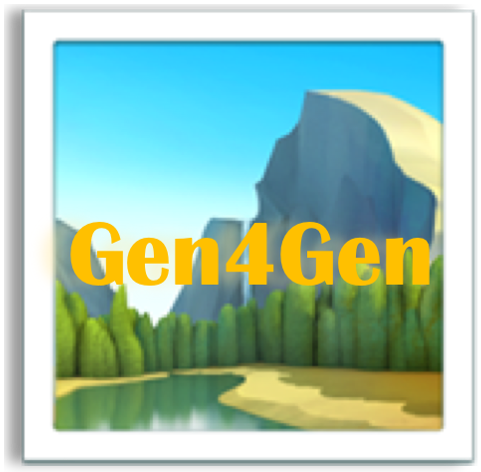

# 1️⃣ Step 1: Object Association and Foreground Segmentation

## 🚩 Current directory path is at `gen4gen`
Please run the following command under the `gen4gen` directory.

### 🔖 Quick Note
- 🔥🔥Before you run, please download DIS-segmentation [pretrained model](https://drive.google.com/file/d/1XHIzgTzY5BQHw140EDIgwIb53K659ENH/view) and save it to `saliency_models/DIS/saved_models/isnet-general-use/isnet-general-use.pth`🔥🔥
- Please prepare your personal images. We have provided personal images in `../data/` directory. The file structure for the personal images are shown in <a href="#0">🗂 Structure of src-dir</a><br>

```bash=
$ python s1_segment_foreground.py --src-dir <source-path> --dest <target-path>
```

### 👇🏼 Quick Run
<details>
<summary>Example</summary>

```bash=
$ python s1_segment_foreground.py --src-dir ../data/s0_source_images --dest ../data/s1_segmented_foreground
```
</details>

---
### 🔠 Arguments

- `--src-dir`: the path of source images (You can put all scenes into the same directory)
- `--dest`: the path of segmented foreground images with masks
- `--rounds`: number of iterations to run the saliency detector (default: 3)
    > We perform several rounds to iteratively remove background (it may not remove all background if running once)

<details>
<summary><a name="0"></a>🗂 Structure of src-dir</summary>

```shell
../data/s0_source_images
└── cat_dog_houseplant_3objs
    ├── cat
    │   ├── sergey-semin-agQhOHQipoE-unsplash.jpg
    │   └── sergey-semin-bK_Ag4nNZ74-unsplash.jpg
    ├── dog
    │   ├── Copy of 0.jpeg
    │   ├── Copy of 3.jpeg
    │   ├── Copy of 5.jpeg
    │   └── Copy of 6.jpeg
    └── houseplant
        ├── Copy of 1.png
        ├── Copy of 2.png
        ├── Copy of 3.png
        └── Copy of 5.png
└── [folder_of_other_scenes]
    ├── [object_name_1]
    │   ├── [image_name_1.jpg]
    │   ├── ...
    │   └── [image_name_n.jpeg]
    ...
    └── [oject_name_n]
```
</details>

---
## Select Segmented Foregrounds

The resulting segmented images and their corresponding masks are saved in `../data/s1_segmented_foreground`.

We also provide segmented images and their masks with other iterations in `../data/s1_segmented_raw`, and you can overwrite them to `../data/s1_segmented_foreground` if they are better.

<details>
<summary>Structure of s1_segmented_foreground</span></summary>

```shell
../data/s1_segmented_foreground
└── cat_dog_houseplant_3objs
    ├── cat
    │   ├── sergey-semin-agQhOHQipoE-unsplash_result_foreground_isnet.png
    │   ├── sergey-semin-agQhOHQipoE-unsplash_result_mask_isnet.png
    │   ├── sergey-semin-bK_Ag4nNZ74-unsplash_result_foreground_isnet.png
    │   └── sergey-semin-bK_Ag4nNZ74-unsplash_result_mask_isnet.png
    ├── dog
    │   ├── Copy of 0_result_foreground_isnet.png
    │   ├── Copy of 0_result_mask_isnet.png
    │   ├── Copy of 3_result_foreground_isnet.png
    │   ├── Copy of 3_result_mask_isnet.png
    │   ├── Copy of 5_result_foreground_isnet.png
    │   ├── Copy of 5_result_mask_isnet.png
    │   ├── Copy of 6_result_foreground_isnet.png
    │   └── Copy of 6_result_mask_isnet.png
    └── houseplant
        ├── Copy of 1_result_foreground_isnet.png
        ├── Copy of 1_result_mask_isnet.png
        ├── Copy of 2_result_foreground_isnet.png
        ├── Copy of 2_result_mask_isnet.png
        ├── Copy of 3_result_foreground_isnet.png
        ├── Copy of 3_result_mask_isnet.png
        ├── Copy of 5_result_foreground_isnet.png
        └── Copy of 5_result_mask_isnet.png
```
</details>

<p align="right">
      
</p>

<p align="right"><a href="README.md">🔙 Back</a></p>
